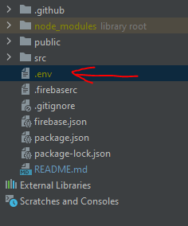
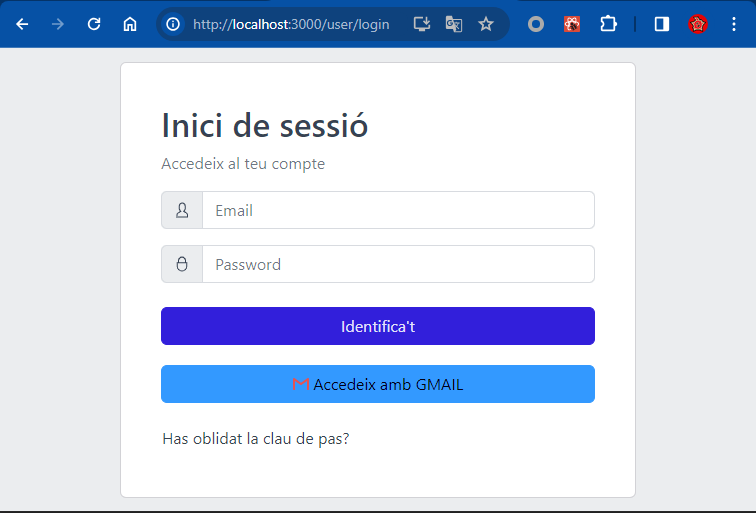
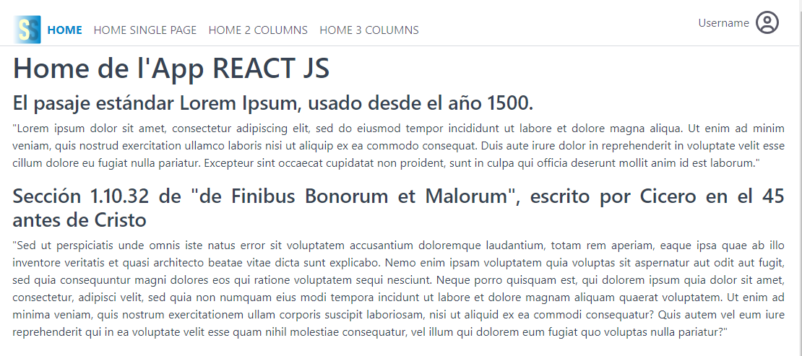

# Paquet de Base per projectes web desenvolupats amb React JS

Aquest repositori ofereix una base de React JS (react-create-app) per crear nous projectes web amb React JS i algunes eines addicionals (firebase de Google) i (Core UI).

## Crear un nou projecte des de GIT

Dins del directori dels nostres projectes, podem fer el clonat amb la comanda següent:

### npx degit smapboot/smap-base#master [nom-del-nostre-projecte]`

📌 **Tip**: Aquesta comanda, clona la carpeta del repositori d'origen a la de destí, però el "degit" ho fa sense clonar l'historic del GIT (commits, etc).
Caldrà posteriorment executar el git init dins del vostre projecte

Un cop hem clonat el projecte des del GIT, executem la instal·lació de les dependencies:

### `npm install`

A continuació, podem posar en marxa el nostre projecte, a l'entorn de desenvolupament

### `npm start`

Obrim [http://localhost:3000](http://localhost:3000) per veure'l al nostre navegador.

Cada canvi que fem al codi, renderitzarà i refrescarà el contingut al navegador.\
Si hi ha errors, els veurem a la consola.

### `npm run build`

Aquesta comanda empaquetarà dins la carpeta build, tot el nostre codi per a desplegar-ho a entorns de producció.

L'aplicació ja està a punt per ser desplegada!

Per més informació, podeu adreçar-vos a [deployment](https://facebook.github.io/create-react-app/docs/deployment).

## Integració amb firebase

Aquest projecte de base, conté un mínim d'integració amb firebase de Google, oferint 2 mètodes d'autenticació d'usuaris:
* Email/Password
* Gmail

Per tal de poder emprar aquesta integració, es requereix que, afegiu el projecte a firebase i que tingueu la vostra pròpia API KEY.

Per saber més sobre API KEYS de firebase, [adreceu-vos aquí](https://firebase.google.com/docs/projects/api-keys?hl=es-419)

Per afegir el vostre projecte a firebase, [comenceu aquí](https://accounts.google.com/InteractiveLogin/signinchooser?continue=https%3A%2F%2Fconsole.cloud.google.com%2F%3Fhl%3Des-419%26_ga%3D2.91662942.556686603.1703060207-181218457.1699358853&followup=https%3A%2F%2Fconsole.cloud.google.com%2F%3Fhl%3Des-419%26_ga%3D2.91662942.556686603.1703060207-181218457.1699358853&hl=es-419&osid=1&passive=1209600&service=cloudconsole&ifkv=ASKXGp0RPIxtRmWkJJkTbGnPUdhJiwc9B1TKOqHDSU0viNDhukXwUaAJo3MJxasu0nx4mu6OAmgF7w&theme=glif&flowName=GlifWebSignIn&flowEntry=ServiceLogin)

Un cop tingueu el projecte afegit a firebase i, obtingudes les credencials d'aquest, necessitareu crear un fitxer de tipus .env per tal de definir aquestes dades i fer funcionar la integració.

Des de firebase, es genera un bloc de codi d'exemple similar a aquest

```javascript
// Import the functions you need from the SDKs you need
import { initializeApp } from "firebase/app";
// TODO: Add SDKs for Firebase products that you want to use
// https://firebase.google.com/docs/web/setup#available-libraries

// Your web app's Firebase configuration
const firebaseConfig = {
  apiKey: "AAAAAAAAAAAAAAAAAAAAAAAAAAAAAAAAAAAAAAAAAAAAAA",
  authDomain: "smap-react-**********************",
  projectId: "smap-react-****************",
  storageBucket: "smap-react-*****************",
  messagingSenderId: "66666666666666666666666",
  appId: "cddcdcdcdcdcdcdcdcdcdcdcdcdcdcdcdcdcdcd"
};

// Initialize Firebase
const app = initializeApp(firebaseConfig);
```
Donat que, disposar d'aquestes dades dins del projecte, és un greu error de vulnerabilitat, ho farem mitjançant el fitxer .env

Aquest fitxer l'hem d'afegir a l'arrel del nostre projecte:



```javascript
REACT_APP_FIREBASE_APIKEY="[valor del atribut apiKey de la const firebaseConfig]"
REACT_APP_FIREBASE_AUTH_DOMAIN="[valor del atribut authDomain de la const firebaseConfig]"
REACT_APP_FIREBASE_PROJECT_ID="[valor del atribut projectId de la const firebaseConfig]"
REACT_APP_FIREBASE_STORAGE_BUCKET="[valor del atribut storageBucket de la const firebaseConfig]"
REACT_APP_FIREBASE_MESSAGING_SENDER_ID="[valor del atribut messagingSenderId de la const firebaseConfig]"
REACT_APP_FIREBASE_APP_ID="[valor del atribut appId de la const firebaseConfig]"
```

Ara, un cop creat aquest fitxer .env, el fitxer de configuració de firebase, ja pren aquests valors i la integració estarà activa amb les vostres claus fora de l'àmbit públic de l'aplicatiu.

```javascript
src/stores/cloud/firebaseDB/firebaseCore.js

import {getAuth} from "firebase/auth";
import {initializeApp} from "firebase/app";
import {getFirestore} from "firebase/firestore";

const firebaseConfig = {
    apiKey: process.env.REACT_APP_FIREBASE_APIKEY,
    authDomain: process.env.REACT_APP_FIREBASE_AUTH_DOMAIN,
    projectId: process.env.REACT_APP_FIREBASE_PROJECT_ID,
    storageBucket: process.env.REACT_APP_FIREBASE_STORAGE_BUCKET,
    messagingSenderId: process.env.REACT_APP_FIREBASE_MESSAGING_SENDER_ID,
    appId: process.env.REACT_APP_FIREBASE_APP_ID
};
const app = initializeApp(firebaseConfig);
export const db = getFirestore(app);
let api;
try{
    api = getAuth(app);
}catch (err){}
export const auth = api || null;
```

A continuació, si tenim el projecte corrent (npm start), aturem i reiniciem perquè prengui els canvis del fitxer .env i, si ho hem fet tot bé, hauríem de veure aquesta pantalla
```javascript
src/bundles/user/pages/UserLogin.jsx
```


📌 **Tip**: Aquesta pantalla d'inici de sessió, només apareix si heu configurat el fitxer .env amb claus vàlides de firebase i, el proveïdor de context, UserProvider no troba cap usuari autenticat. En cas contrari, hauríeu de poder veure la pàgina de la home d'exemple

```javascript
src/pages/Home.jsx
```



A partir d'aquí, la resta ja va per compte vostre.

Feliç codificació 
